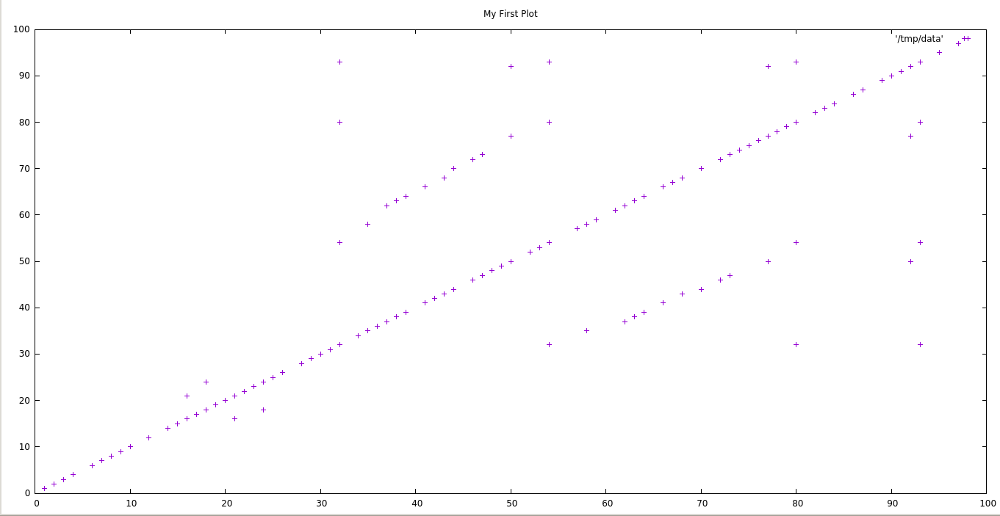
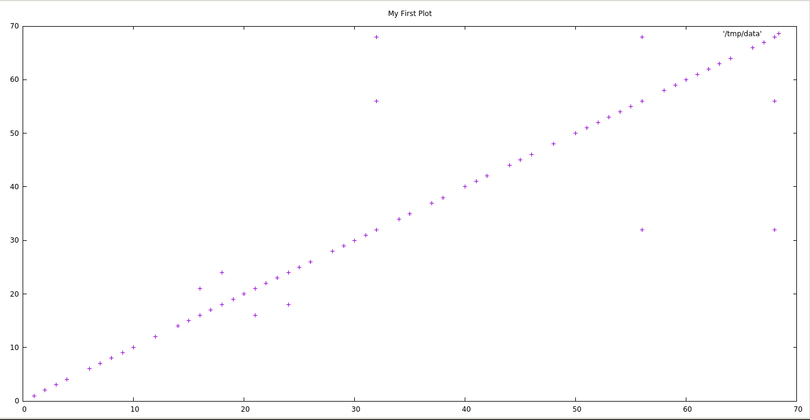
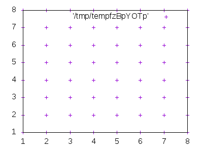
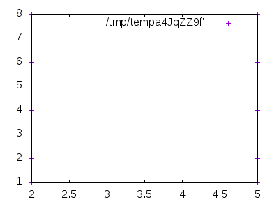
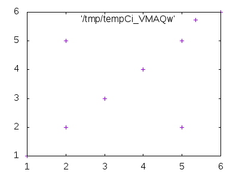

# Dupplot

Visualizing duplications and copypastes graphically via plots of line
matches

## Dependencies

- Perl

- gnuplot

## Usage

    perl dupplot.pl file1 file2 [output_image_name]

## Story
Lately I've been having to deal with some codebase which I suspected
it had lots of duplicated code.

My task was actually fix some parts of the application, cleanup the
some of the parts, and end up owning the code as mine.

So it was a perfect opportunity for me to give a serious thougth to
[http://scg.unibe.ch/download/oorp/](Object Oriented Reengineering
Patterns),
[https://martinfowler.com/books/refactoring.html](refactoring), and
[https://www.goodreads.com/book/show/44919.Working_Effectively_with_Legacy_Code](Working
with legacy code).  I started with OORP, because it's the less widely
known about all three, and I thought maybe there would be advice
that's not widely covered on other places in the internet.

Among other advices (and related to other works in the smalltalk
world), there's the thougth about trying to look at the code in
different ways, not the obvious 'lines of text'.

So here's dupplot, a small script I wrote to visualize code
duplication through dotplots.

While working with dupplot itself, I started pushing lines of code,
to make it work the first time. And then, I was thinking that I had
some code duplication (opening the file, normalizing lines,etc.) but
it was generally ok-ish.

Just for the sake of testing the program against itself, I ran it, and
got this:

So I thought that I'd try to fix some of the duplication, and yeah,
now it looks much better.

Way better, no?

Btw, the fix+own project went from 9k+ lines to 4k+, and bugs were
fixed on the way, and tests were added on the way. :)

## More examples:

Being the file a:

    1
    1
    1
    1
    1

And the file b:

    2
    1
    3
    4
    1
    5

This are some combinations:

- a vs a:

- a vs b:

- b vs b:

## License

WTFPL

## Author

Raimon Grau <raimonster@gmail.com>
