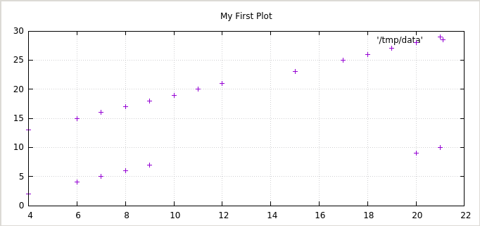

# Dupplot

Visualizing duplications and copypastes graphically via plots of line
matches

This is the example after running dupplot against t/file-a.txt and t/file-b.txt

- Here is the comparison of dupplot_old.pl against itself

- And after seeing about the duplication, I decided to refactor
it. It's the current dupplot.pl

Way better, no?

More examples:

Being the file a:

    1
    1
    1
    1
    1

And the file b:

    2
    1
    3
    4
    1
    5

This are some combinations:

- a vs a:

- a vs b:

- b vs b:

